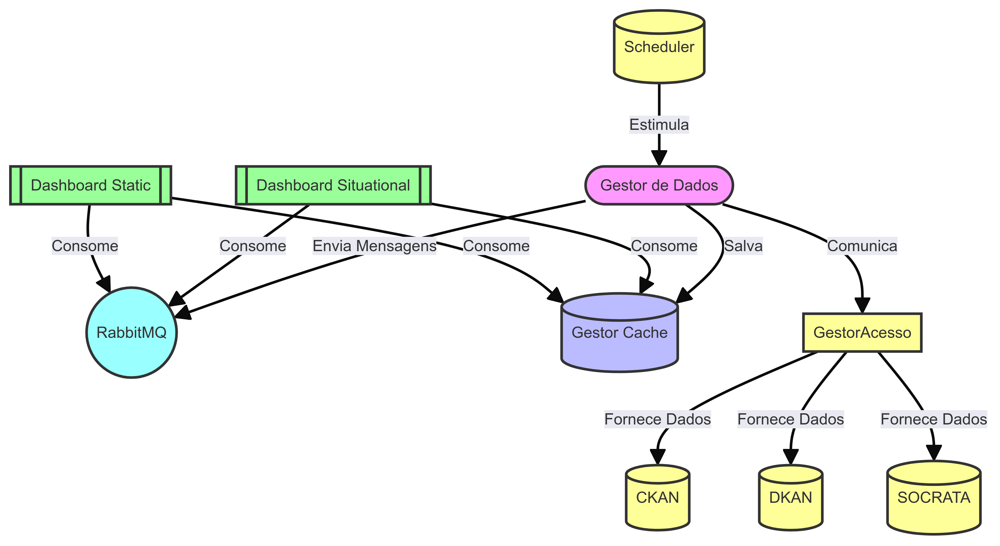
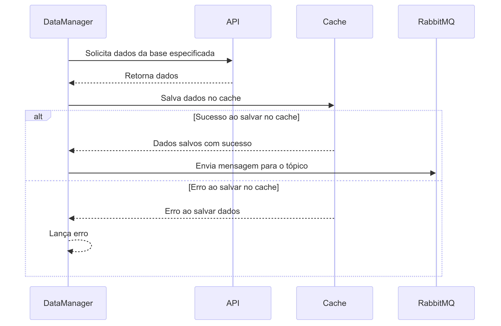
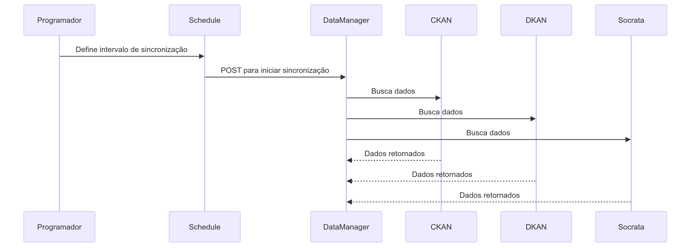

# Grupo 4 - Gestor de Dados e Schedule

## Visão Geral do Projeto

Este projeto, intitulado "Group-4-Distributed-Systems", foi desenvolvido como parte de uma disciplina de Sistemas Distribuídos. O objetivo principal é implementar conceitos de sistemas distribuídos através de um projeto prático, envolvendo a comunicação entre processos, sincronização e coordenação de tarefas distribuídas.

## Diagramas

Nesta seção, incluímos diagramas que ajudam a entender a arquitetura e o fluxo do sistema distribuído implementado no projeto.

### Diagrama de Componentes



### Diagrama de Sequência do Schedule



### Diagrama de Sequência do Data Manager



## Estrutura do Projeto

O repositório do projeto está organizado da seguinte forma:

- `src/`: Contém o código-fonte do projeto.
  - `controllers/`: Implementação do controllers que se comunica com o Gestor de Acesso aos dados.
  - `services/`: Implementação das regras de negócio.
  - `repositories/`: Contratos que são usados nos services.
  - `model/`: Classes que representam os objetos da aplicação.
  - `infrastructure/`: Componentes de aplicações externas ou configurações do sistema.
- `docs/`: Documentação adicional do projeto, incluindo especificações e diagramas.
- `tests/`: Testes unitários e de integração para garantir a qualidade do código.
- `scripts/`: Scripts auxiliares para automação de tarefas, como configuração do ambiente e execução de testes.
- `README.md`: Documento principal com instruções básicas sobre o projeto.

## Pré-requisitos

Para executar o projeto, você precisará dos seguintes pré-requisitos:

- [Linguagem de Programação Utilizada Java](https://www.java.com/): Certifique-se de ter a versão adequada instalada, verifique no arquivo `pom.xml`.
- [Bibliotecas e Dependências](https://www.example.com/): Instale todas as bibliotecas necessárias listadas no arquivo `pom.xml`.

## Instalação

Siga os passos abaixo para configurar o ambiente e executar o projeto:

1. Clone o repositório:
    ```sh
    git clone https://github.com/franklaercio/group-4-distributed-systems.git
    cd group-4-distributed-systems
    ```

2. Instale as dependências:
    ```sh
    mvn clean install
    ```

## Execução

Para executar o projeto, siga os passos abaixo:

1. Inicie o servidor:
    ```sh
    java -cp target/group-4-distributed-systems.jar br.ufrn.manager
    ```

2. Inicie os clientes:
    ```sh
    java -cp target/group-4-distributed-systems.jar br.ufrn.manager.Application
    ```

## Funcionalidades

- **Comunicação Cliente-Servidor:** Implementação de protocolos de comunicação entre clientes e servidores.
- **Sincronização:** Mecanismos de sincronização para garantir a consistência dos dados distribuídos.
- **Coordenação de Tarefas:** Algoritmos para coordenação de tarefas distribuídas, garantindo que todas as partes do sistema trabalhem em harmonia.

## Testes

Para garantir a qualidade do código, o projeto inclui testes unitários e de integração. Para executar os testes, utilize o seguinte comando:

```sh
mvn test
```

## Contribuição

Se você deseja contribuir para este projeto, siga os passos abaixo:

1. Faça um fork do repositório.
2. Crie uma branch para sua feature ou correção de bug:
    ```sh
    git checkout -b feat-nova
    ```
3. Faça commit das suas alterações:
    ```sh
    git commit -m 'feat: adiciona minha feature'
    ```
4. Envie para o repositório remoto:
    ```sh
    git push origin feat-nova
    ```
5. Abra um Pull Request.

## Licença

Este projeto está licenciado sob a Licença MIT. Veja o arquivo [LICENSE](LICENSE) para mais detalhes.

## Contato

Para mais informações ou dúvidas sobre o projeto, entre em contato com o grupo.
